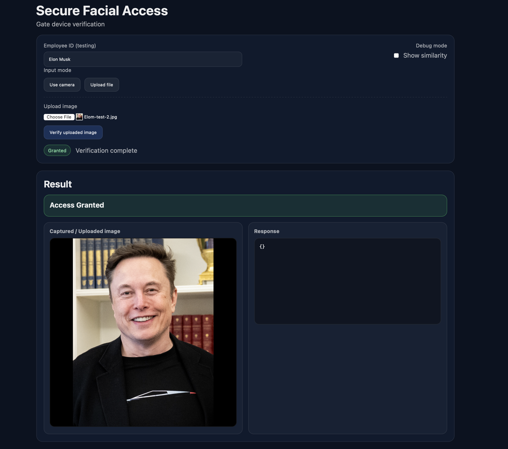
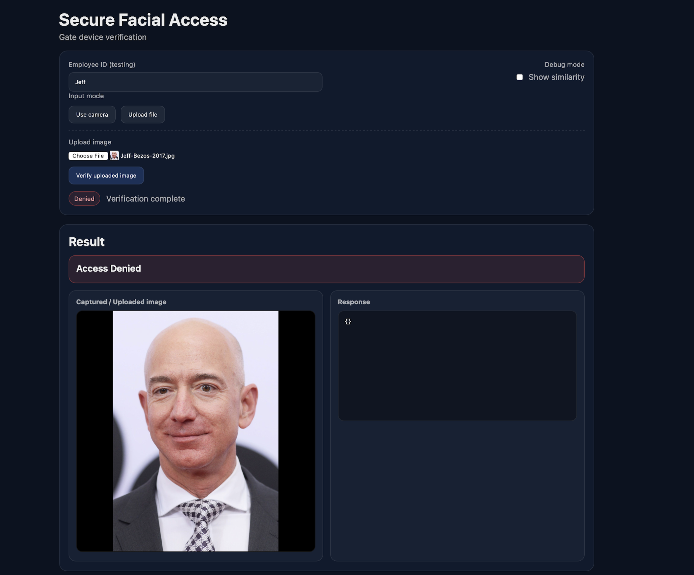

# Secure AWS Facial Recognition Access System

A production-style facial recognition access control system built on AWS.  
This project simulates how real-world gate devices authenticate employees using facial recognition while keeping credentials and sensitive logic off the edge.

The system separates **admin enrollment** from **gate verification**, mirrors real access control architectures, and emphasizes security boundaries, auditability, and least privilege.

---
# Architectural Diagram

## Why I Built This

Most facial recognition demos stop at “it works.”

This project goes further and answers harder questions:

- How do you secure enrollment without exposing credentials to devices?
- How do you let gate devices authenticate users without logging in?
- How do you prevent image uploads from becoming a security risk?
- How do you audit every access attempt?

---

## High-Level Architecture

**One API Gateway. Two trust planes. Clear separation of responsibility.**

### Admin Plane (Authenticated)
- Used only by administrators
- Protected by Amazon Cognito
- Handles employee enrollment

### Gate Plane (Unauthenticated)
- Used by physical gate devices or kiosks
- No credentials stored on the device
- Uses short-lived S3 presigned URLs
- All identity decisions happen server-side

This mirrors how real badge readers and access gates work.

---

## System Flow

### Enrollment Flow (Admin)
1. Admin logs in via Cognito
2. Admin uploads employee image
3. Image is stored securely in S3
4. Lambda indexes the face into Amazon Rekognition
5. Employee metadata is recorded for verification and auditing

### Verification Flow (Gate Device)
1. Gate device captures or uploads an image
2. Device requests a presigned S3 upload URL
3. Image is uploaded directly to S3 (no credentials exposed)
4. Gate calls verification endpoint
5. Rekognition compares the image against enrolled faces
6. Access is granted or denied
7. Verification attempt is logged to DynamoDB

---

## Core AWS Services Used

- **Amazon API Gateway**  
  REST API with separate admin and gate security models

- **AWS Lambda**  
  Serverless business logic for presigning, enrollment, and verification

- **Amazon Rekognition**  
  Face indexing and facial comparison

- **Amazon S3**  
  Secure image storage with blocked public access and logical prefixes

- **Amazon DynamoDB**  
  Audit and verification event logging

- **Amazon Cognito**  
  Authentication for admin enrollment only

- **AWS KMS**  
  Encryption at rest for stored images and logs

- **Amazon CloudWatch**  
  Logs and metrics for all Lambda executions

---

## Security Design Decisions

- Gate devices **never authenticate**
- No AWS credentials are stored on the client
- Image uploads use **short-lived presigned URLs**
- Admin actions are fully authenticated and isolated
- Verification logic runs only on the backend
- All access attempts are auditable

These decisions intentionally reduce blast radius and credential exposure.

---

## UI Behavior

The UI is intentionally designed to behave like a real gate:
The authenticated user is enrolled by admin while the unauthenticated user is not.

- **Access Granted**  
  Green banner with confirmation message

  

- **Access Denied**  
  Red banner with rejection message

  

- Similarity scores are hidden by default
- Debug mode exists only for development and testing

This keeps the product behavior clean while still allowing inspection during development.

---

## Example Results

### Successful Authentication
- Employee was enrolled by admin
- Facial match exceeded threshold
- Access granted

### Failed Authentication
- Employee was not enrolled
- Facial match not found
- Access denied

Both outcomes are logged for audit purposes.

---

## What This Project Demonstrates

- AWS serverless architecture
- Secure API design with multiple trust zones
- Proper use of presigned S3 uploads
- Facial recognition with Rekognition
- Thoughtful security boundaries
- Auditability and observability
- Clean separation between admin and device workflows

---

## 🔐 Security Design Decisions & Threat Model

This system was designed with security as a **primary requirement**, not something added later to make the demo look safe.

The goal was to build a facial recognition access flow that mirrors how a real production access control system would be deployed in AWS, with clear trust boundaries and a minimal blast radius.

---

### Threats Considered

The following risks were explicitly considered during design:

- Unauthorized users uploading images directly to S3
- Replay or reuse of previously captured facial images
- Accidental public exposure of biometric data
- Over-privileged Lambda or API Gateway roles
- Enumeration of enrolled employees through API responses
- Leakage of similarity or confidence scores
- Direct or indirect exposure of AWS credentials to the client

The architecture and permissions were shaped around reducing these risks rather than optimizing for convenience.

---

### Key Security Decisions

#### 1. No Client AWS Credentials

At no point does the frontend receive AWS credentials.

- All uploads use short-lived presigned S3 URLs
- URLs are scoped to a single object key and expire quickly
- The client cannot list buckets, read objects, or reuse URLs

This removes an entire class of credential leakage and abuse.

---

#### 2. Segmented APIs by Trust Level

The system intentionally separates actions by trust level:

- **Admin enrollment APIs** are protected by Amazon Cognito
- **Gate verification APIs** are intentionally unauthenticated but tightly scoped
- IAM permissions differ between enrollment, upload, and verification Lambdas

This reflects a real environment where:
- Admin actions require identity
- Gate devices are treated as semi-trusted infrastructure
- Compromise of one path does not grant lateral access

---

#### 3. Biometric Data Protection

All facial images and derived data are treated as sensitive:

- S3 buckets block all public access
- Server-side encryption uses SSE-KMS with customer-managed keys
- Rekognition collections are never exposed to the client
- Images are accessed only by Lambda execution roles

The frontend never directly interacts with stored biometric data.

---

#### 4. Minimal Response Exposure

The verification API returns **only what the gate needs**:

- Access Granted or Access Denied
- No similarity scores by default
- No face metadata
- No internal Rekognition identifiers

A debug mode exists for testing, but production behavior is intentionally opaque.  
This mirrors how real access control systems operate.

---

#### 5. Auditability and Traceability

Every verification attempt is logged:

- Timestamped verification events
- Object references
- Match outcome
- Environment and project context

This enables post-incident review, behavioral analysis, and future alerting.

---

### Intentional Tradeoffs

This project intentionally prioritizes:

- Clear security boundaries over feature density
- Stateless verification over persistent sessions
- Least privilege over convenience
- Explicit flows over hidden abstractions

### Why This Matters

This project is not meant to be a toy demo.

It is designed to demonstrate:

- How to structure serverless systems with real security boundaries
- How to protect sensitive data using native AWS controls
- How to design systems with attackers in mind, not just users

Every major design choice assumes that **something will eventually fail**, and the system should fail safely.

---

## Final Notes

This is not a demo built to impress visually.  
It’s built to show **how I think about systems, security, and architecture**.

That was the goal.

